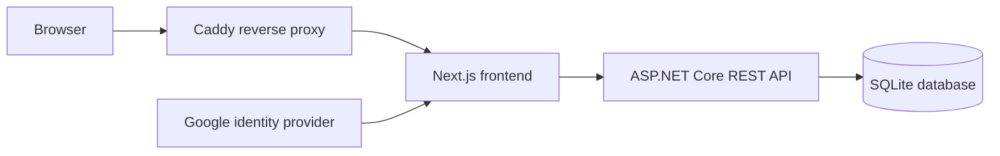

# Financial Tracker

[](https://github.com/atforche/Financial-Tracker/actions/workflows/release.yml)
[](https://github.com/atforche/Financial-Tracker/actions/workflows/backup-production.yml)

A self-hosted financial planning and tracking application for managing accounts,
transactions, funds, goals, and accounting periods.

Financial Tracker helps organize financial activity into a coherent history of
balances and transactions, then provides summaries and trends for reviewing
progress over time.

> Project status: in development.

## Features

- Track accounts, financial institutions, account types, and balance history.
- Record income, spending, account, and fund transactions.
- Organize money into funds and fund goals.
- Review balances, progress, assignments, and trends by accounting period.
- Manage users, invitations, administrator access, and read-only access.
- Use deterministic local identities during development.
- Authenticate production users through invited Google accounts.

## Architecture



The application is composed of:

- **Frontend:** Next.js, React, TypeScript, MUI, and Recharts.
- **Backend:** ASP.NET Core REST API, domain services, Entity Framework Core,
  and SQLite.
- **Repository tooling:** A Python 3.14 command-line orchestrator exposed as
  `ft`.
- **Deployment:** Docker images behind Caddy, with GitHub Actions handling
  verification, release, deployment, and backup workflows.

## Quick start

### Prerequisites

The versions used by local development and CI are defined in
[`config/toolchain.toml`](config/toolchain.toml).

- Python 3.14
- Node.js 24.19.0 and npm
- .NET SDK 10
- Docker with the Compose plugin, when using the container stack
- Trivy 0.73.0, when running security or container verification commands. The
  dependency installer downloads it to the ignored `.tools/` directory when it
  is not already available on `PATH`.

From the repository root, install the repository tooling and its dependencies.
Use `python` instead of `python3.14` if it already refers to Python 3.14.

```sh
python3.14 -m orchestrator deps install
source .venv/bin/activate
ft deps check
```

### Run the local container stack

The container stack is the quickest way to run the complete application locally:

```sh
ft debug stack-up
```

The command creates the ignored `debug/.env` file, generates a local
authentication secret, builds the images, applies database migrations, and waits
for the services to become healthy.

Open the application at [http://localhost:3001](http://localhost:3001). The API
and its development Swagger UI are available at
[http://localhost:8081/swagger](http://localhost:8081/swagger).

The local login page provides three identities:

- Administrator
- Standard user
- Read-only user

Stop the services while retaining local database volumes:

```sh
ft debug stack-down
```

Stop the services and remove their Compose volumes:

```sh
ft debug stack-destroy
```

`stack-destroy` removes the local container database and logs. Run it only when
you are ready to recreate the local data.

## Native VS Code debugging

Use the native workflow when you need to debug the frontend or API process
directly. Create the local configuration, SQLite database, and schema once:

```sh
ft debug create
```

Then select a launch configuration from
[`.vscode/launch.json`](.vscode/launch.json):

- `UI (server-side)`
- `UI (client-side)`
- `REST API (swagger)`
- `REST API (UI)`

All native debug processes load their environment from the generated
`debug/.env` file. The launch profiles do not define environment-variable
overrides; update the debug template and regenerate the ignored file when the
local environment contract changes.

After adding a backend migration, update the existing native database with:

```sh
ft debug upgrade
```

Remove the native debug configuration, database, and logs with:

```sh
ft debug destroy
```

The native frontend and API use the same local ports as the container stack:
`3001` for the frontend and `8081` for the API.

## Common commands

All repository operations are available through the `ft` command. Run
`ft --help` or a command-specific `--help` for the complete interface.

| Command | Purpose |
| --- | --- |
| `ft deps install` | Install Python, frontend, backend, .NET tool, and Trivy dependencies |
| `ft deps check` | Verify the configured toolchain versions |
| `ft backend build` | Build the .NET solution |
| `ft backend test` | Run backend tests |
| `ft backend create-migration <name>` | Create a database migration |
| `ft frontend build` | Build the Next.js application |
| `ft frontend install-browser` | Install Chromium for frontend end-to-end tests |
| `ft ci run` | Run the complete repository verification pipeline |
| `ft security scan-dependencies` | Scan application dependencies |
| `ft security scan-images` | Scan deployable container images |
| `ft env validate --profile debug --file debug/.env` | Validate local configuration |

When an API contract changes, the backend-generated OpenAPI document and the
frontend models are checked together by the API-contract verification step.

## Configuration and authentication

The environment contract and generated profile defaults are defined in
[`config/environment.toml`](config/environment.toml). The checked-in examples
are generated from that schema:

- [`config/profiles/debug.env.example`](config/profiles/debug.env.example) for
  local development.
- [`.env.example`](.env.example) for production deployment values.

Local development uses `AUTH_MODE=development`. This mode is accepted only by
an API running with `ASPNETCORE_ENVIRONMENT=Development`, and it does not
require Google credentials. The debug environment generates its own Auth.js
session secret.

Production uses `AUTH_MODE=google`. Users must be invited through the
database-backed user-management flow and sign in with the invited Google
account. Production requires `GOOGLE_CLIENT_ID`, `GOOGLE_CLIENT_SECRET`, and
`AUTH_SECRET`.

Never commit OAuth credentials, authentication secrets, backup credentials, or
real financial data. Use ignored local environment files or an approved secret
store.

## Testing and CI

The repository uses separate workflows for quality checks, verification, release,
deployment, and backups:

- [`Code Quality`](.github/workflows/code-quality.yml) checks Python, backend,
  and frontend formatting and linting.
- [`Verification`](.github/workflows/verification.yml) builds and tests the
  backend and frontend, verifies the generated API contract, scans dependencies,
  and smoke-tests the container images.
- [`Release`](.github/workflows/release.yml) builds, scans, tests, and publishes
  immutable container images when `main` changes.
- [`Backup Production`](.github/workflows/backup-production.yml) creates and
  verifies scheduled encrypted backups.

Before opening a pull request, run:

```sh
ft ci run
```

The most useful targeted checks are:

```sh
ft ci python
ft ci backend-test
ft ci frontend-build
# Run after ft ci backend-test when validating the generated API contract.
ft ci api-contract
ft ci container-images
```

## Production deployment

Production runs from immutable container images on a self-hosted Linux GitHub
Actions runner with the `production` label. The target host must have Docker
installed.

Configure the GitHub `production` environment with:

- **Variables:** `INSTANCE_PATH`, `INSTANCE_NAME`, `ENVIRONMENT` (normally
  `Production`), `PUBLIC_ORIGIN`, `GOOGLE_CLIENT_ID`, and `INITIAL_ADMIN_EMAIL`.
- **Secrets:** `GOOGLE_CLIENT_SECRET` and `AUTH_SECRET`.

The release workflow publishes images and a release manifest when `main` changes.
To deploy, dispatch **Deploy Production** from `main` with the full commit SHA and
the ID of a successful release workflow run. A new instance is created when
`INSTANCE_PATH` does not exist; an existing valid instance is updated
transactionally and retains its previous release.

On the first deployment, `INITIAL_ADMIN_EMAIL` receives the bootstrap
administrator invitation. Additional users are invited by an administrator from
the application.

The deployment workflow is defined in
[`deploy-production.yml`](.github/workflows/deploy-production.yml).

To roll back an instance to its previous healthy release:

```sh
ft deploy rollback --path /srv/financial-tracker
```

Rollback restores the previous application release, but it does not undo
database migrations. Take and verify a backup before deployments that change the
database schema.

## Backups

Backups use Restic and require `RESTIC_REPOSITORY` and `RESTIC_PASSWORD`. The
production backup workflow also supports object-storage credentials through the
variables documented in [`config/environment.toml`](config/environment.toml).

For a deployed instance, the operations are:

```sh
ft backup initialize --path /srv/financial-tracker
ft backup backup --path /srv/financial-tracker
ft backup verify --path /srv/financial-tracker
```

The scheduled GitHub Actions workflow runs regular backups and restore
verification. Keep the backup repository off the application host.

## Repository layout

```text
backend/       ASP.NET Core API, domain, data, and tests
frontend/      Next.js application and Playwright tests
orchestrator/  Repository management CLI
config/        Toolchain and environment contracts
compose*.yaml  Local and production container definitions
.github/       CI, release, deployment, and backup workflows
```

## Contributing

Keep changes focused and run the relevant `ft` checks before submitting a pull
request. Backend schema changes should include a migration and verification of
the generated API contract when applicable.

## License

No license file is currently included in this repository.
